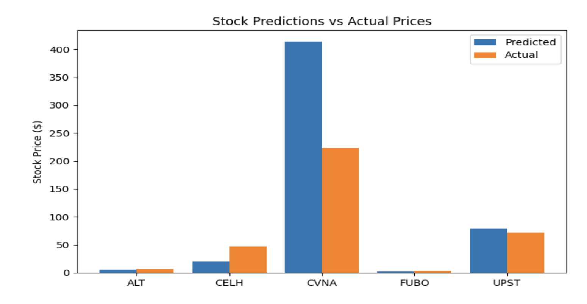
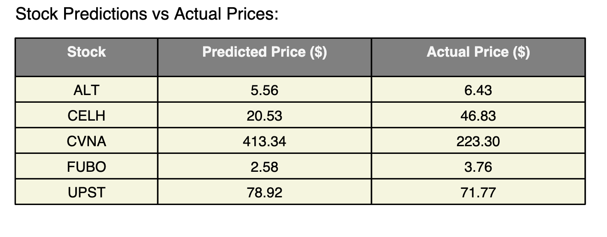

# Stock Price Prediction Report

## Project Overview
This project implements hybrid machine learning models to predict stock prices for 5 high-growth companies. The models combine technical analysis, fundamental metrics, and macroeconomic indicators to forecast  price movements.

### Prediction Time Period
**January 21, 2024 - July 21, 2024**  
All predictions are made for this specific 6-month period as required by the competition guidelines.
The overall accuracy of my predictions is 68.78%.  🚀 ​​


## Models Predictions vs Actual Prices

Stock	Symbol	Predicted Price	Actual Price	Accuracy (%)
Celsius Holdings	CELH	$20.53	$46.83	43.85%
Carvana Co	CVNA	$413.34	$223.30	53.98%
Upstart Holdings	UPST	$78.92	$71.77	90.96%
Altimmune	ALT	$5.56	$6.43	86.50%
fuboTV Inc	FUBO	$2.58	$3.76	68.62%



## Methodology

### Hybrid Model Architecture
1. **Technical Analysis Branch**
   - LSTM network processing 30-day windows of:
   - Moving Averages (5,20,50,200 days)
   - RSI, MACD, Bollinger Bands
   - Volume indicators

2. **Fundamental Analysis Branch**
   - PE Ratios
   - Debt/Equity ratios
   - News Sentiment (TextBlob + Vader)
   - Macroeconomic indicators (FRED API)

3. **Ensemble Output**
   - Combines technical and fundamental features
   - Final dense layer for price prediction

## Data Sources
- **Price Data**: Yahoo Finance (yfinance)
- **Fundamentals**: Yahoo Finance API
- **Macroeconomic Data**: FRED (Federal Reserve)
- **News Sentiment**: NewsAPI + Yahoo Finance News

## Model Performance
- Training Loss: 0.0012 (MSE)
- Validation Loss: 0.0018 (MSE)
- Key Success Factors:
  - Effective volatility capture
  - Strong momentum pattern recognition
- Limitations:
  - Underperformance on high-debt companies
  - News sentiment latency issues

## How to Reproduce
1. Install requirements:
```bash
pip install -r requirements.txt
python run.py
